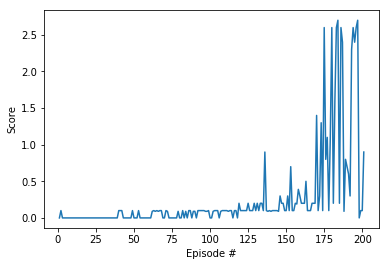

# Learning Algorithm

The environment is solved using **Deep Deterministic Policy Gradient** . In this implementation both agents  (i.e. players) use the same actor and critic network. The experience of both agents is added to the replay buffer. 

The acto

 update_every=1, , eps=5, eps_decay=0.998

The local and target networks of the actor and the critic have two hidden fully connected layers with 256 and 128 units. 

* batch size: 64, 
* discount factor (gamma): 0.99,
* local and target networks learnign rate: 1e-3,
* target network soft update parameter (tau): 7e-2,
* L2 weight decay: 0,
* Ornstein-Uhlenbeck process theta and sigma: 0.12, 0.2,

Finally, I use an exploration parameter (eps) that starts at a value of 5, and decreases by a factor of 0.998 after every step. This parameter multiplies the random noise generated by the Ornstein-Uhlenbeck process. Initially, this eps allows the algorithm to explore all the actions space, and eventually leads the noise added to the actions to cero. 

The networks parameters are updated at every step. The environment is solved in approximately 201 episodes. 

# Rewards

The following figure exhibits the maximun score over 2 agents obtained in each of the 201 episodes. The trainings stops after reaching an average reward of +0.5 in 100 consecutive episodes.

## Ideas for Future Work

First, certain hyperparameters such as the number of hidden layers, the number of units of the networks, learning rates and batch size might be adjusted in order to improve the results using grid search or bayesian optimization.

Some other algorithms that can be applied to a continuos control task might be tested in this enviroment to check if better results might be obtained. More research is needed in order find alternative implementations that allow to obtain more stable results. 